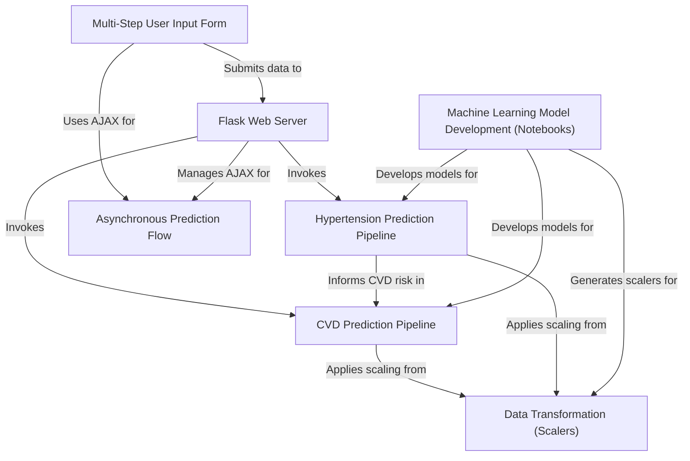

# End-to-End Cardiovascular Risk Prediction Web App Using Flask and Machine Learning

## Overview
 

|  |
|:--:|
| *System Architecture of the Cardiovascular & Hypertension Risk Prediction Web App* |

 

## Objectives
- End-to-end ML workflow from Jupyter to live Flask deployment ✅  
- Multi-step user form with async flow for seamless UX ✅  
- Dual-model inference: Hypertension informs CVD prediction ✅  
- Centralized, reusable data transformation (scalers) ✅  
- Modular, readable architecture for scalability and maintenance ✅  

## Dataset
- Sourced from public health repositories like `UCI Heart Disease` and `Hypertension` datasets  
- Contains structured clinical records: `age`, `gender`, `cholesterol`, `blood pressure`, `ECG`, `lifestyle factors`  
- Includes labels for `hypertension stages` and `CVD risk` outcomes  
- Preprocessed with `cleaning`, `normalization`, and `class balancing` techniques  
- Format: `CSV` files, optimized for `Pandas`-based pipelines in model training  
- Suitable for `binary classification` and `medical risk staging` using `supervised learning`

## Intuition

Most health risk systems treat hypertension and cardiovascular disease as parallel tasks. But in clinical reality, hypertension is not just a condition—it’s often a precursor that elevates CVD risk over time. This project encodes that progression structurally: the system first predicts hypertension stage using core vitals, then feeds that prediction into the cardiovascular risk model, mimicking the diagnostic flow used by real clinicians. The goal isn’t just to classify but to emulate how health conditions evolve and interact over time. Rather than relying on deep, complex architectures, we prioritize interpretable ML models that are transparent, reliable, and suited for structured health records. Preprocessing plays a vital role: raw clinical metrics vary wildly in range and unit, so consistent scaling and imputation are essential to preserve integrity across users. The entire design is shaped by one core belief—medical AI must mirror biological causality and clinical judgment, not just maximize metrics.

- The CVD model accepts hypertension stage as a feature, reflecting its real-world impact on heart disease.  
- Simpler classifiers are favored to maintain interpretability and reduce overfitting on small, structured datasets.  
- Scalers are saved and reused during inference to maintain statistical alignment between training and serving.  
- The architecture encodes clinical progression, not just classification, making predictions more contextually grounded.

## Model Performance Comparison
#### CVD Risk Prediction (Binary Classification)

| Model                    | Accuracy (%) | MAE     | Precision (0/1) | Recall (0/1) | F1-Score (0/1) |
|--------------------------|--------------|---------|------------------|---------------|----------------|
| Logistic Regression      | 87.5         | 0.125   | 0.93 / 0.84      | 0.81 / 0.94    | 0.87 / 0.88     |
| SVC                      | 84.78        | 0.152   | 0.90 / 0.81      | 0.78 / 0.91    | 0.84 / 0.86     |
| Random Forest Classifier | 86.96        | 0.130   | 0.90 / 0.84      | 0.82 / 0.91    | 0.86 / 0.88     |
| Decision Tree Classifier | 83.70        | 0.163   | 0.84 / 0.84      | 0.84 / 0.84    | 0.84 / 0.84     |
| K-Nearest Neighbors      | 83.70        | 0.163   | 0.89 / 0.80      | 0.77 / 0.90    | 0.82 / 0.85     |
| Gaussian Naive Bayes     | 87.5         | 0.125   | 0.91 / 0.84      | 0.82 / 0.92    | 0.87 / 0.88     |
| SGD Classifier           | 81.52        | 0.185   | 0.84 / 0.79      | 0.77 / 0.86    | 0.80 / 0.82     |
| Extra Trees Classifier   | 90.22        | —       | —                | —              | —               |

#### Hypertension Stage Prediction (Multi-Class Classification)

| Model                    | Accuracy (%) | MAE     | Precision (0/1/2/3) | Recall (0/1/2/3) | F1-Score (0/1/2/3) |
|--------------------------|--------------|---------|----------------------|-------------------|---------------------|
| Decision Tree Classifier | 100.0        | 0.0     | 1.00 / 1.00 / 1.00 / 1.00 | 1.00 / 1.00 / 1.00 / 1.00 | 1.00 / 1.00 / 1.00 / 1.00 |
